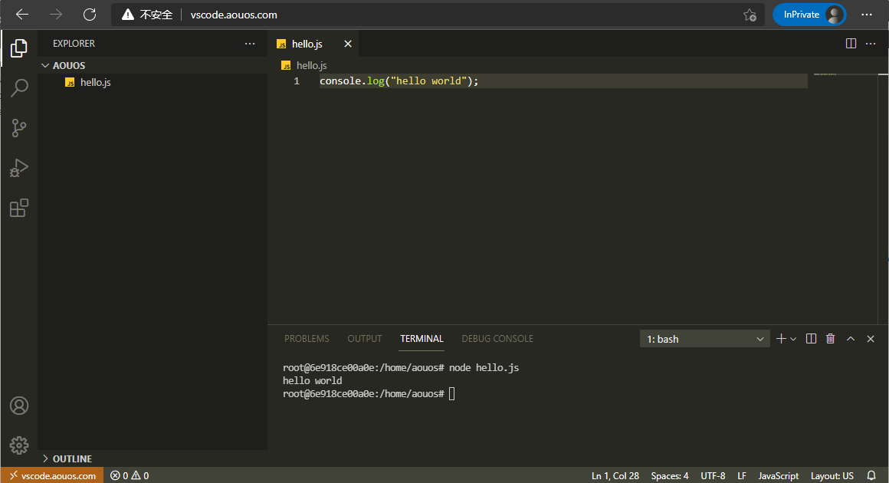

# CodeServer_VScode

## Demo Link

😜 Experience [VScode](http://vscode.aouos.com) 

🎨 Preview effect



---

## image

pull image from docker hub

```bash
docker pull aouos/code-server
```

Build image

```bash
docker build --tag <name> .
```

---

## Create and start the container 

```bash
docker run -it -p 8080:8080 --name <name> <code-server name> bash
```

Start code-server

```bash
code-server
```

Start in the background 

```bash
nohup code-server >> /root/codeserver.log 2>&1 &
```

---

## Build yourself images

In the Dockerfile sibling directory :

```bash
docker-compose up -d
```

---

## Nginx proxy
proxy port 8080

```shell
server {
    listen       80;
    listen  [::]:80;
    server_name  vscode.aouos.com;

    location / {
        proxy_pass   http://127.0.0.1:8080/;
        proxy_set_header Host $host;
        proxy_set_header Upgrade $http_upgrade;
        proxy_set_header Connection upgrade;
        proxy_set_header Accept-Encoding gzip;
    }

    error_page   500 502 503 504  /50x.html;
    location = /50x.html {
        root   /usr/share/nginx/html;
    }
}
```

---
